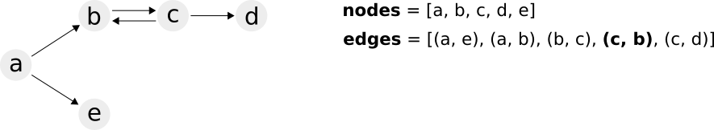
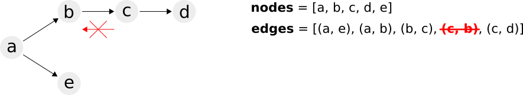
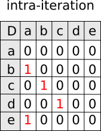
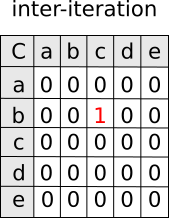
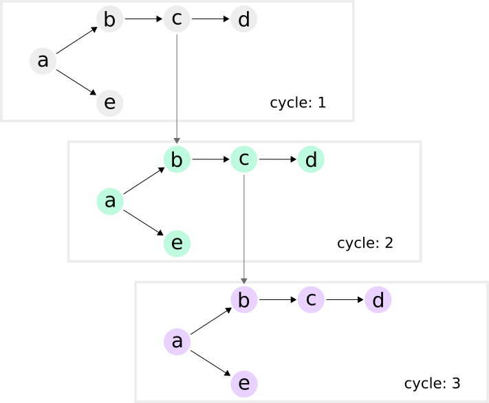

# decyclify

Graph decyclify algorithm implementation as in Sandnes &amp; Sinnen paper (2004) in Python.

**"A new strategy for multiprocessor scheduling of cyclic task graphs", link to [article in Research Gate](https://www.researchgate.net/publication/220298826_A_new_strategy_for_multiprocessor_scheduling_of_cyclic_task_graphs).**

See open issues for current status of the project.

## decyclify algorithm

The algorithm uses two matrices, `D` and `C`.

`D` is the **intraiteration dependencies** matrix. It represents the dependencies
in the graph within a cycle.

`C` is the **interiteration dependencies** matrix. It represents the dependencies
in the graph between cycles.

## Node Iterators

This is not part of the paper. Here we show how the algorithm can be used to first remove the
cycles. Next, we use the matrices to decide how to traverse the graph.

The first iterator, the `CycleIterator` simply goes through all the tasks in the cycles and executes
them in order. The `decyclify` function is used to avoid repeating a node due to a cycle.

The second iterator available is the `TasksIterator`. With this, for each cycle it returns the next tasks
available, as well as any tasks in the next cycles that can be returned.

A task is considered ready to be returned when its sibling in the previous cycle has been executed, and after
its inter-cycle dependency (if any) has been satisfied as well.

It should be possible to use these iterators, or create new ones, and apply it to tools
such as workflow managers that support only DAG scheduling, to schedule an infinite
graph, via **graph-unrolling**. The next cycle is simply an integer counter incremented,
but could be an ISO8601 date-time function.

> NOTE: this part of the project was a summer holidays project, and is in need of documentation,
> more tests, code review, etc. Feel free to submit pull requests.

## Changelog

**0.1 (2020-12-29)**

- Added a couple of node iterators. With these, it is possible to iterate the graph per cycle, or per task. This latter enables a task to start as soon as its sibling in a previous cycle has been executed, as long as there are no inter-cycle dependencies. 
- [#3](https://github.com/kinow/decyclify/issues/3) Implemented the algorithm to unroll a graph using the Decyclify algorithm
- [#10](https://github.com/kinow/decyclify/issues/10) Create intraiteration matrix (D) and interiteration matrix (C)
- [#2](https://github.com/kinow/decyclify/issues/2) Graph input
- [#1](https://github.com/kinow/decyclify/issues/1) Build and packaging

## License

Licensed under the Apache License. See `LICENSE` for more.

